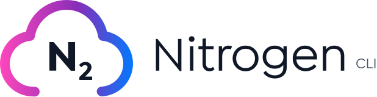

<div align="center">
  
</div>

# Nitrogen CLI

Nitrogen is a tool for deploying web services to AWS Nitro Enclaves.

## Commands

- `nitrogen setup <stack name> <key-name> --instance-type <ec2-instance-type>  -p <port> -s <ssh_location`
- `nitrogen build <Dockerfile>`
- `nitrogen deploy <enclave-image-file> <ec2-hostname>`
- `nitrogen delete <ec2-hostname>`

## Features

- Spins up any EC2 instance type (with Nitro Enclaves enabled)
- Creates a security group for a specified port.
- Sets up SSH.
- Runs a socat proxy from public internet (TCP) into the nitro enclave (VSOCK).
- Builds any Dockerfile into an Enclave Image File (EIF).
- Deploys any EIF and launches a nitro enclave.

## Examples

`nitrogen setup nitrogen-test ec2-key --instance-type m5n.16xlarge`
> Successfully setup enclave with stack ID "arn:aws:cloudformation:us-east-1::stack/nitrogen-test/500860b0-53d1-11ed-967c-0ebc7567a9a9"
>   Enclave user information:
>     InstanceId: i-0dd81f6b48396b020
>     PublicIP: 54.164.195.92
>     AZ: us-east-1c
>     PublicDNS: ec2-54-164-195-92.compute-1.amazonaws.com
```

```sh
$ nitrogen build Dockerfile --name nginx

> Filename: nginx.eif
```

```sh
$ nitrogen deploy nginx.eif ec2-1-234-56-789.compute-1.amazonaws.com`

> Listening: ec2-1-234-56-789.compute-1.amazonaws.com:443
```

```sh
$ curl https://ec2-1-234-56-789.compute-1.amazonaws.com/

> Hello World
```
